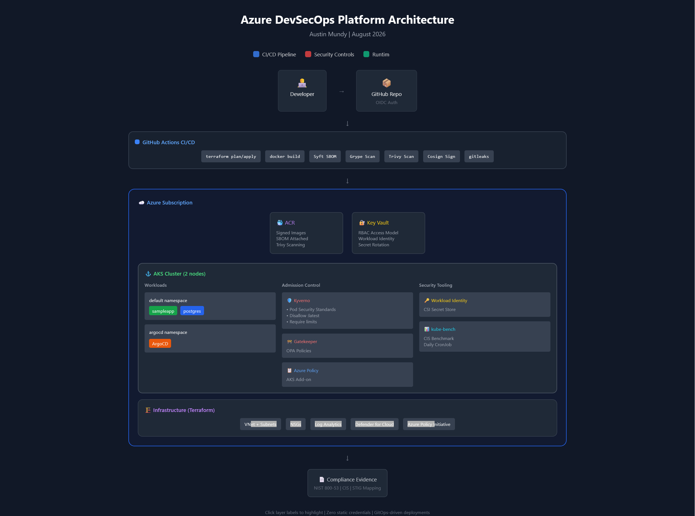

markdown

# Azure DevSecOps Platform

A Kubernetes-based application platform on Azure demonstrating continuous security validation, policy-as-code enforcement, and compliance evidence generation.

## Architecture



The platform implements defense-in-depth across four layers:

**CI/CD Security** — GitHub Actions authenticates to Azure via OIDC federation (no stored secrets). Every container image is scanned with Grype/Trivy, signed with Cosign, and includes an SBOM generated by Syft. Gitleaks prevents secrets from entering the repository.

**Infrastructure Security** — Terraform provisions AKS with Azure AD integration, Azure Policy, and Defender for Cloud. The bootstrap storage account uses blob versioning and soft delete to protect state files. All infrastructure changes flow through GitOps.

**Runtime Security** — Kyverno and Gatekeeper enforce admission policies including signature verification, Pod Security Standards, and resource limits. Workload Identity binds pods to managed identities for secret access—no credentials stored in the cluster.

**Observability** — Key Vault diagnostic logs, Azure Activity Log, ArgoCD Git history, and Kyverno PolicyReports provide audit trails. Defender for Cloud generates continuous compliance scores.

## Security Controls

| Layer | Control | Implementation |
|-------|---------|----------------|
| Identity | No static credentials | OIDC federation + Workload Identity |
| Supply Chain | Image integrity | Cosign signatures verified at admission |
| Supply Chain | Dependency tracking | Syft SBOM + Grype vulnerability scanning |
| Secrets | Zero secrets in Git | Gitleaks pre-commit + CI gate |
| Secrets | Runtime injection | Secrets Store CSI Driver + Key Vault |
| Admission | Policy enforcement | Kyverno + Gatekeeper + Azure Policy |
| Runtime | Container hardening | Pod Security Standards (restricted) |
| Network | Microsegmentation | Kubernetes NetworkPolicies |

## Compliance Status

Based on the latest evidence collection:

**Defender for Cloud:** 40% secure score (10/25 points). Key gaps in network restrictions and vulnerability remediation are documented in the threat model.

**Kyverno Policies:** 145 passed, 23 failed. Failures are isolated to kube-system components (expected for AKS-managed workloads) and the kube-bench Job which requires host namespace access by design.

**Gatekeeper Constraints:** 16 Azure Policies deployed in dryrun mode for visibility before enforcement.

## Repository Structure

├── .github/workflows/ # CI/CD pipelines with security gates
├── terraform/
│ ├── bootstrap/ # State storage + OIDC federation
│ └── environments/ # AKS, ACR, Key Vault, networking
├── kubernetes/
│ ├── policies/ # Kyverno + Gatekeeper policies
│ └── apps/ # Application manifests
├── scripts/
│ └── collect-compliance-evidence.sh
└── docs/
├── architecture-diagram.png
├── threat-model.md
└── compliance-report.md
angelscript


## Threat Model Summary

Full STRIDE analysis available in [docs/threat-model.md](docs/threat-model.md).

**Residual risks identified:**

1. Terraform state storage lacks private endpoint — low effort to remediate
2. No namespace resource quotas configured — medium effort
3. OIDC service principal scoped to subscription rather than resource group — should tighten

## Quick Start

```bash
# Bootstrap (one-time)
cd terraform/bootstrap
terraform init && terraform apply

# Deploy infrastructure
cd ../environments/lab
terraform init && terraform apply

# Get cluster credentials
az aks get-credentials --resource-group rg-dev --name aks-dev

# Verify policies
kubectl get clusterpolicy
kubectl get policyreport -A

Evidence Collection
bash

./scripts/collect-compliance-evidence.sh > docs/compliance-report.md

Generates Defender for Cloud scores, Kyverno PolicyReports, Gatekeeper constraint status, and formats them for audit review.
License

MIT
applescript
